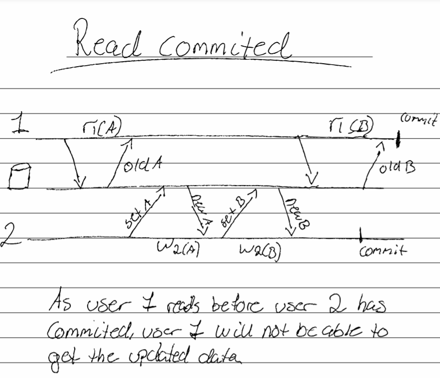
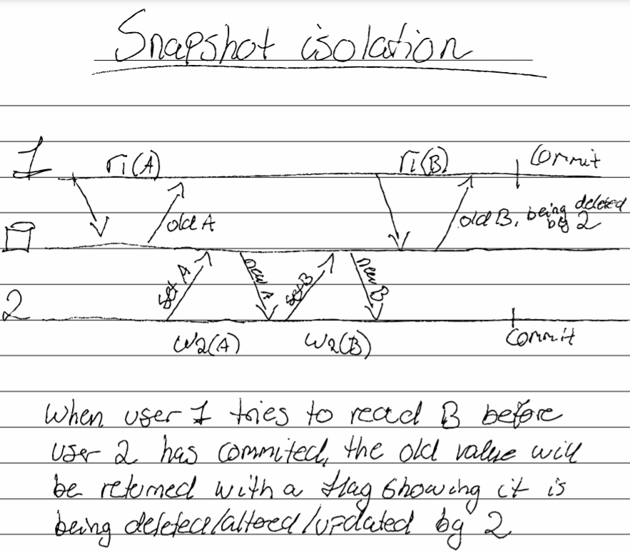
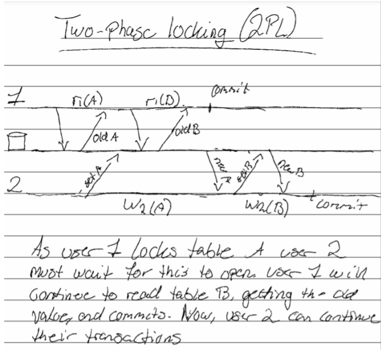

---
# These are meta-variables defined with YAML syntax, change them as you wish.
# see https://pandoc.org/MANUAL.html#variables
title: TDT4225 Exercise 4
author:
  - Hauk Aleksander Olaussen
date: \today # This is a latex command, ignored for HTML output
lang: en-US
papersize: a4
geometry: margin=4cm
toc: false
toc-title: "List of Contents"
toc-depth: 2
numbersections: false
colorlinks: true
links-as-notes: true
# The document is following the break written using Markdown syntax
---

## 1. Kleppmann Chap 5

a) 
**When should you use multi-leader replication, and why should you use it in these cases? When is leader-based replication better to use?**

As Kleppmann says: "It rarely makes sense to use multi-leader replication within a single datacenter". 

Usecases for this approach then makes us turn our head toward operations distributed over multiple datacenters. This will make each datacenter have its own leader, which will be the one to recieve the writes, but it will share and recieve data from other leaders in other datacenters. This will improve performance as a client may connect to any of the leaders in any datacenter (probably the one closest geographically), and not just one designated leader in one datacenter somewhere in the world. It will also tolerate a whole datacenter failing due to some fault - be it network problems or outages. The database will still be operating while the faulty datacenter is catching up to the rest.

Still, multiple datacenters is not the only usecase for multi-leader replication. They are appropriate to use when needing an application to work without internet connection, and then "sync" up when reconnected. This makes each device act as a datacenter/leader updating itself when it gets updated data from another device. Kleppmann uses the calendar on our phones and other devices as an example for this. It may also be used in applications where collaborative editing is a thing. Multi-leader replication will allow these applications (users) to share their local replica with other users, and with some conflict handling, allowing them to write in the same document simultaneously.

When not having the operation distributed over multiple datacenters, using leader-based replication with just a single leader will propably be a better approach. One of the reasons for this is that we do not need to worry about conflicts when it comes to writing. All the followers will update themselves based on the leader, and nothing else - meaning that the leader has absolute control. This means, however, that should the leader fail, a user can not write to the database. This is dealt with by assigning one of the followers as the new leader, a process called *failover*. For smaller scale applcations, the single leader approach will probably be a better choice.

b) 
**Why should you use log shipping as a replication means instead of replicating the SQL statements?**

We would not want to just replicate the SQL statements given to the leader if it includes non-deterministic functions, as this would mean that we write data to the follower not neccessarily equal to the leaders. Here, log shipping would be a better approach. Another case is if the statements depend on data already existing in the database. This would mean that the SQL statements must be executed in the same order as they did on the leader to ensure that the data is the same. 

As we can see, just replication the SQL statements on the follower will not neccessarily give us the result we want, and we must then use another approach - namely different kinds of log shipping.

c) 
**How could a database management system support read your writes consistency when there are multiple replicas present of data?**

Read-after-write consistency (read-your-writes) essentially means that a user should always see the data they themselves have submitted. It ensures this by always reading data that the user has modified from the leader, which always has the most recent data. If most of the things in the application are able to be edited by the user, this approach will not do, as most of the data will have to be read from the leader. Another way of ensuring this is to save time of the last update, and after a set time (Kleppmann uses 1 minute in his example), all the reads will be made from the leader. One can also save the timestamp and make sure that the read is handled by a replica sufficiently up do date, or wait until the current one is.

There are other related problems to this - namely *monotonic reads* and *consistent prefix reads*, which considers the user always seing data it has already seen, and always viewing the data that makes causal sense, respectively.

## 2. Kleppmann Chap 6

a) 
**Why should we support sharding / partitioning?**

Being able to split the data into partitions resting on different computers ensures scalability for the application. This will help with distributing both disk usage, and query load across the nodes.

b) 
**What is the best way of supporting re-partitioning? And why is this the best way? (According to Kleppmann)**

Kleppmann discusses different ways of rebalancing the data into new partitions in the nodes. He first discusses "hash mod N", which for obvious reasons do not work well for operations where the amount of nodes changes. He speaks positively around a solution with a fixed number of partitions where each node is assigned multiple partitions, and when a new node is introduced, it steals some from the other nodes. The difficult part with doing it this way is getting the number of partitions for each node just right. If the partitions are large, rebalancing and recovery will become too expensive. Too small, and there will be too much overhead.

Because of these negative features, we turn to dynamic rebalancing. A new partition is introduces when a partition exceeds some set size. The data is split between the old and the new. This keeps the number of partitions adapting to the size of the data - which scales well with little overhead. One problem is that for when the dataset is small, it will be processed by a single node until it splits. This is negated with *pre-splitting* where an initial configured set of partitions is created for an empty database. Kleppmann also discusses partitioning based on the number of nodes, and not the data size. This will scale well when we introduce new nodes, and as the data volume increases (as we probably will need new nodes). When a new node is added to the cluster, it will randomly split some partitions and take over half the data for each. This may cause unfair splits, but when averaged over the number of partitions each node have, it will not end up as fair as one might think. Kleppmann speaks higly of this approach - dynamic partitioning proportional to the number of nodes.

c) 
**Explain when you should use local indexing, and when you should use global indexing?**

As *local indexing* makes writes more efficient as you can just write to the document you can just use the partition that contains that document. Reads however is another story, as you will need to query all partititons and combine the results to get the full picture. Needless to say - this is expensive.

*Global indexing* on the other will have the opposite effect. As the indexes themselves are partitioned, reading will be very efficient as we just query the partition containing the term we want. Writing is the slow part with doing it this way, as a write may affect multiple partitions - making it expensive.

Hence, one should use *local indexing* when you are expecting a lot of writes, and *global indexing* when expecting a lot of reads.

## 3. Kleppmann Chap 7

a) 
**We want to compare read committed with snapshot isolation. We assume the traditional way of implementing read committed, where write locks are held to the end of the transaction, while read locks are set and released when doing the read itself. Show how the following schedule is executed using these two approaches:** \newline
***r1(A); w2(A); w2(B); r1(B);c1;c2;***

See figures 1 and 2.

b) 
**Also show how this is executed using serializable with 2PL (two-phase locking).**

See figure 3.

c) 
**Explain by an example write skew, and show how SSI (serializable snapshot isolation) may solve this problem**

If a write is dependent on some data which have been altered within its commit, it will abort this transaction, as the consistency of the snapshot have been compromised. 

We can use the example Kleppmann uses. Both doctors Bob and Alice wants to check whether or not two or more doctors are on call. If this is true, they will put themselves off call. There must always be one doctor on call. They only change their own table. As both doctors check this concurrently - the condition of two or more will be true for both. As we are using SSI, a snapshot have been created at the start of the transactions. When alice commits, Bob is unaware that she has gone off, and goes off himself. However, the transaction manager sees that Alices value has changed from the snapshot, refusing Bob to commit his changes, and aborts the transaction. Bob still has to work. 

\newpage
## 4. Kleppmann Chap 8

a) 
**If you send a message in a network and you do not get a reply, what could have happened? List some alternatives.**

There are countless things that can be the reason for not getting a reply to a message sent over a network. It can be that the machine you are sending the message to is not connected to the network, and is then unable to answer it. It can be that the sender lost internet connection before recieving the reply. If the sender or reciever of the message has a very high load on its network, it can cause delays larger than the timeout, resulting in the sender not getting the reply within the expected timeframe. It can also happen that both machines work as they should, without any problem, but somewhere along the way the reply to the message was lost. Maybe due to a faulty machine or network relayer. 

b) 
**Explain why and how using clocks for last write wins could be dangerous.**

As clocks may differ from node to node, relying on clocks for *last write wins* may result in data being dropped silently. In a many leader scenario, if two machines get instructions within a timeframe shorter than their clocks differ, this could result in one of the instructions being lost in a third machine who replicates the data - as it will think that the operation with the latest time wins the race, when in fact this was the latter operation, but the clocks were wrong. If we could ensure that the all clocks were equal at any point in time, this would work, but we can not - hence, it is dangerous to rely on them.

c) 
**Given the example from the text book on “process pauses”, what is the problem with this solution to obtaining lock leases?**

As the example relies on synchronized clocks, we may fall into some pits. The `lease.expiryTimeMillis` field is set by another computer, which most likely will have a clock that differs from the leader's. If this difference is large, it may cause the leader to think it is still the leader, when it's actually not, or vice versa. We may also have some problems if the process pauses in the middle of execution. This may cause the first lines to execute fine, making the leader not renew the lease as the old one is still fine, but the later lines will be executes some time after, which might be when the lease is not valid anymore. This will, once again, lead to the leader thinking its the leader, when some other node has taken over the job.

## 5. Kleppmann Chap 9

a) 
**Explain the connection between ordering, linearizability and consensus.**

The goal of lineraizability is to make a system appear as if there is only one copy of the data. This means that when two users request some data, they should recieve the same values at any point in time. Ordering helps perserve *causality*, which means that we can be certain that requests that depend on each other, happens in the order we want it to. Concurrent requests can be ordered arbitrarily. En example is that a question cannot be answered before it is asked. In a linearizable system, we have a total order of operations - meaning that we can pick any two elements, and compare them (who came before the other). Ordering on *causailty* will be a partial ordering, as we can compare some elements, but not all. One type of ordering used is *timestamp ordering*, where nodes keep track of requests. Consensus concerns getting nodes to agree on something. This can be on who the leader node is, what the outcome of a transaction will be, or something else. Consensus involves a asynchronous system of processes, which might be unreliable. Total order broadcast is a protocol for exchanging messages between nodes that must ensure reability and that the ordering properties are always satisfied. The order is fices at the time the messages are delivered, meaning that a node cannot change the order of the messages if earlier messages have alreay been delivred - making total order broadcast stronger than timestamp ordering.

b) 
**Are there any distributed data systems which are usable even if they are not linearizable? Explain your answer.**

Yes. As linearizability comes with a performance hit, many opts to not support it. If the system supports linearizability nodes will become unavailable if theu are disconnected from other nodes, and not neccessarily end users. This will lead to more "dead" nodes than it actually is. The system will also take a longer time to process requests, as we have to ensure that the data sent back is the latest written. If the system is not linearizable each node can process the requests independently, even if it is disconnected from other nodes. The system will be available if a network error (or some other error) occurs, but it might not give the absolute latest updated data.
This tradeoff is described in the CAP theorem, which says that you can pick 2 out of 3 of *Consistensy*, *Availability* and *Partition*, but you can not have all three. Kleppmann argues that a better way to phrase it is "*either Consistent or Available when Partitioned*", as you can have a linearizable available system if it is not partitioned, but of course, with one points of failure. He also argues that this theorem is highly debated and narrow with a lot of misunderstanding and confusion - hinting that there might exist some solutions to the problem.

## 6. Coulouris Chap 14

a) 
**Given two events e and f. Assume that the logical (Lamport) clock values L are such that L (e) < L (f). Can we then deduce that e "happened before" f? Why? What happens if one uses vector clocks instead? Explain.**

No we cannot. The implication only goes one way. If an event *e* happened before an event *f* (physically), we can be absolutely sure that this will be represented correctly as *L(e) < L(f)* with Lamport timestamps, but not vice versa. This is because *e* and *f* can be concurrent events, just ordered in this way to perserve the total order. If we were to use vector clocks, this will not be the case. A process will increment its designated position in the vector every time an event occurs. This means that we can directly compare the values of the vector to find out if events happend before, after or concurrently with one another. If *V(e) < V(f)* then *e* happened before *f*.  If *V(f) < V(e)* then *e* happened after *f*. And if *V(e) <= V(f) and V(f) <= V(e)* then *e* and *f* are concurrent.

\newpage
b) 
**The figure below shows three processes and several events. Vector clock values are given for some of the events. Give the vector clock values for the remaining events.**

|   |            |
|---|------------|       
|*b*| `(4, 0, 0)`|
|*k*| `(4, 2, 0)`|
|*m*| `(4, 3, 0)`|
|*c*| `(4, 3, 2)`|
|*u*| `(4, 4, 0)`|
|*n*| `(5, 4, 0)`|

c) 
**The figure below shows the events that occur at two processes P1 and P2. The arrows mean sending of messages. Show the alternative consistent states the system can have had. Start from state S00. (Sxy where x is p1's state and y is p2's state)**

See figure 4.

## 7. RAFT

**RAFT has a concept where the log is replicated to all participants. How does RAFT ensure that the log is equal on all nodes in case of a crash and a new leader?**

## 8. Dynamo

**Explain the following concepts/techniques used in Dynamo:**

- consistent hashing
- vector clocks
- sloppy quorum and hinted handoff
- merkle trees
- gossip-based membership protocol